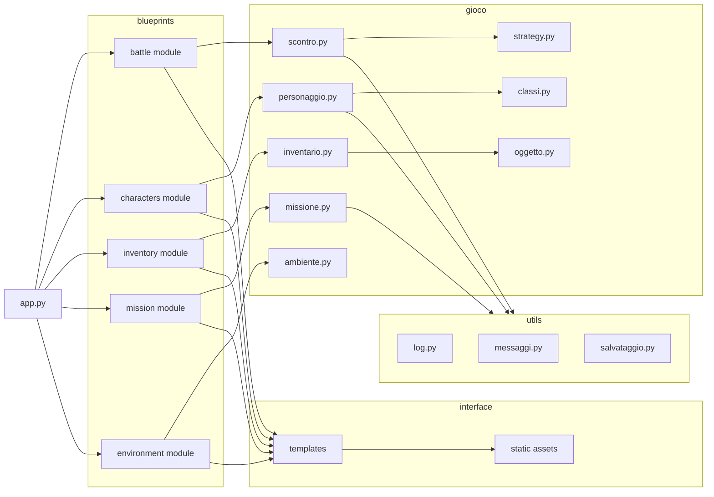
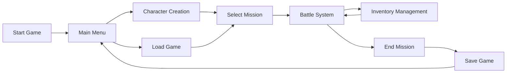
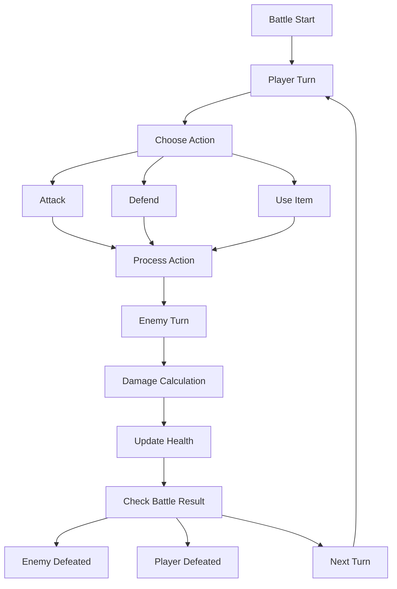
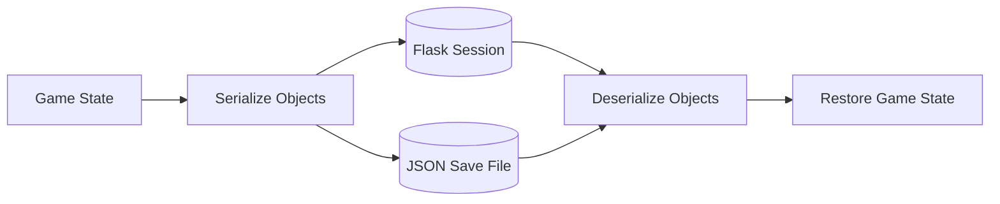

# GDR (Gioco di Ruolo) — System Flow Diagrams

This document illustrates the main execution flows and architecture of the **GDR (Gioco di Ruolo)** web RPG application.

The diagrams describe how the system connects:

- the user interface
- Flask application routes
- the game engine
- gameplay systems
- persistence mechanisms

---

# System Architecture Diagram

This diagram shows the overall interaction between the **web interface**, **Flask backend**, and the **game engine**.

```mermaid
flowchart TD

User[User Browser]

FlaskApp[Flask Application]

Blueprints[Flask Blueprints]

Templates[Jinja Templates]

GameEngine[Game Engine Module]

Characters[Character System]

Combat[Combat System]

Inventory[Inventory System]

Missions[Mission System]

Environment[Environment System]

Persistence[(Session / JSON Save)]

User --> FlaskApp

FlaskApp --> Blueprints

Blueprints --> Templates

Blueprints --> GameEngine

GameEngine --> Characters
GameEngine --> Combat
GameEngine --> Inventory
GameEngine --> Missions
GameEngine --> Environment

GameEngine --> Persistence
````

---

# Layered Architecture Diagram

This diagram represents the **layered structure** of the application.

```mermaid
flowchart TB

subgraph Presentation Layer
Browser[User Browser]
Templates[Jinja Templates]
Static[Static Assets]
end

subgraph Web Layer
FlaskApp[Flask App]
Routes[Blueprint Routes]
end

subgraph Application Layer
GameFlow[Game Flow Controller]
SessionManager[Session Management]
end

subgraph Game Engine Layer
Characters[Character System]
Combat[Combat Engine]
Inventory[Inventory System]
Missions[Mission Logic]
Environment[Environment System]
Items[Item System]
end

subgraph Persistence Layer
Session[(Flask Session)]
JSON[(JSON Save Files)]
end

Browser --> FlaskApp

FlaskApp --> Routes
Routes --> Templates
Routes --> GameFlow

GameFlow --> Characters
GameFlow --> Combat
GameFlow --> Inventory
GameFlow --> Missions
GameFlow --> Environment
GameFlow --> Items

GameFlow --> SessionManager

SessionManager --> Session
SessionManager --> JSON
```

---

# Internal Module Architecture

This diagram reflects the **real project structure**.



---

# Gameplay Flow Diagram

This diagram describes the **player gameplay progression**.



---

# Combat Flow Diagram

This diagram illustrates the **turn-based combat logic**.



---

# Save / Load Game Flow

This diagram describes how the game state is stored and restored.



---

# Summary

These diagrams illustrate the main structural elements of the **GDR RPG system**:

* modular Flask architecture
* layered application structure
* object-oriented game engine
* turn-based combat flow
* persistent game state management

The system is designed to remain **modular, extensible, and maintainable**, allowing future evolution toward a **Flask API + React frontend architecture**.

